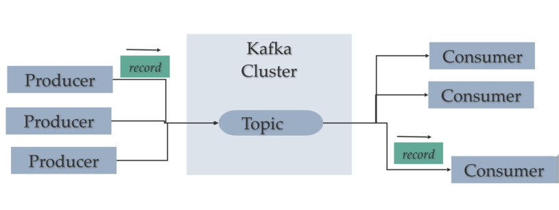
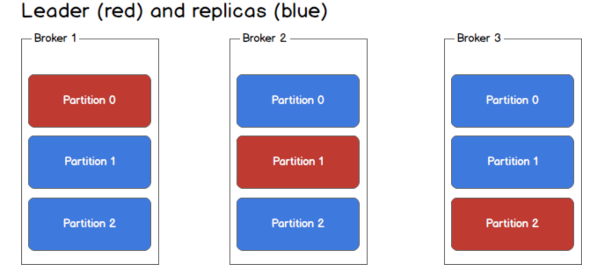
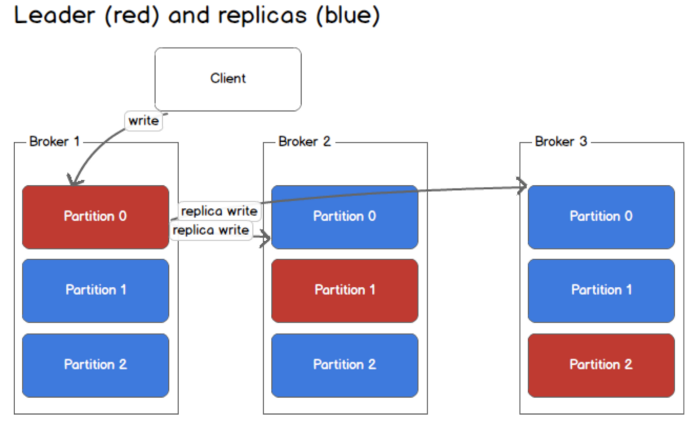
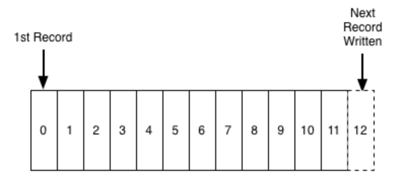
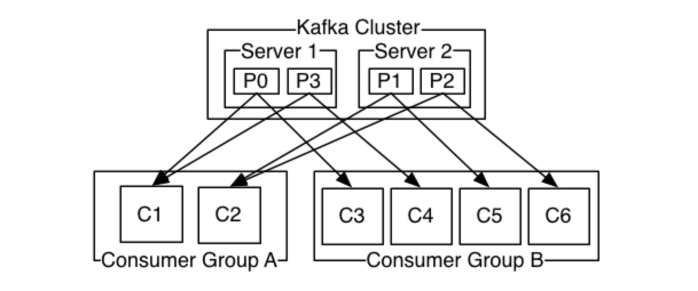
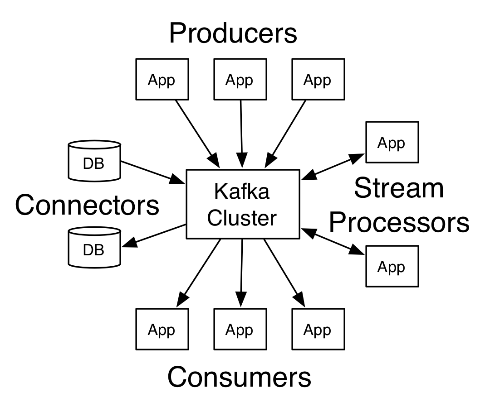

# 深入阅读的进一步阅读
+ Kafka文档-Kafka的详尽指南
+ Kafka Streams变得简单— Kafka stream API的简要介绍
+ Kafka Connect —要进一步了解Kafka Connect API

感谢您抽出时间来阅读。
# 结论

有充分的理由，Kafka迅速成为任何组织数据管道的骨干。 通过Kafka，您可以使大量消息通过集中式媒体进行存储，而不必担心性能或数据丢失。

Kafka可以成为事件驱动架构的核心，并允许您真正将应用程序彼此分离。
# Zookeeper的角色

Zookeeper是一个分布式键值存储。 对其进行了高度优化，但写入速度较慢。 Kafka使用Zookeeper进行Kafka Broker和Topic Partition的领导选举。 Zookeeper也非常容错，应该如此，因为Kafka严重依赖它。

它用于存储各种元数据，其中包括：
+ 消费者组每个分区的偏移量（尽管现代客户将偏移量存储在单独的Kafka主题中）
+ ACL（访问控制列表）—用于限制访问/授权
+ 生产者和消费者配额-最大消息/秒边界
+ 分区负责人及其健康

生产者和消费者不直接与Zookeeper交互以了解分区的领导者和其他元数据，而是向Kafka Broker提出元数据请求，而Kafka Broker与Zookeeper交互并给出元数据响应，然后生产者和消费者就知道哪个 他们需要分别读写表格的分区。
# 卡夫卡如何运作

Kafka基于发布/订阅模型。 它类似于任何消息传递系统。 应用程序（生产者）将消息（记录）发送到Kafka节点（经纪人），并且所述消息由称为消费者的其他应用程序处理。 消息存储在主题中，使用者可以订阅该主题并收听这些消息。 消息可以是任何内容，例如传感器测量值，仪表读数，用户操作等。

> Kafka Producer and Consumer Model


可以将主题视为存储/发布消息的类别/源名称。
# 隔断

Kafka主题的大小可能很大，因此可能无法将一个主题的所有数据存储在单个节点中，因此需要将数据划分为多个分区。 分区允许我们通过跨多个代理（Kafka节点）拆分特定主题中的数据来并行化主题，即每个分区可以放置在单独的机器上，以允许多个使用者并行地从主题中读取内容。 主题分区可以基于任何事物，例如它们的进入顺序，哈希，id等。

为了提高分区的可用性，每个分区还具有副本。 为了更好地理解它，我们有一个由3个节点/代理组成的Kafka集群。

现在，一个主题分为3个分区，每个代理都有每个分区的副本。 在这些分区副本中，一个人当选为领导者，而其他人只是被动地使自己与Leader保持同步。

> There are 3 partitions of a topic named as Partition 0, Partition 1 and Partition 2


对主题的所有写入和读取都将通过相应的分区领导程序，并且领导程序协调使用新数据更新副本。 如果领导者失败，则副本将接任新的领导者。

> Write is only through leader and replicas get updated asynchronously.


为了使生产者/消费者从分区中进行写入/读取，他们需要知道其领导者，对吗？ 这些信息需要在某个地方可用。Kafka将此类元数据存储在名为Zookeeper的服务中。
# 日志解剖

Kafka性能和可伸缩性的关键是日志。 初听此“日志”时，开发人员常常会感到困惑，因为我们习惯于根据应用程序日志来理解“日志”。 但是，我们在这里谈论的是日志数据结构。 日志是一种持久的有序数据结构，仅支持追加。 您不能修改或删除记录。 从左到右读取它，并保证项目排序。

> Log structure


数据源将消息写入日志，并且一个或多个使用者在他们选择的时间点从日志中读取消息。

此日志中的每个条目都由offset唯一标识，offset只是一个顺序索引号，就像数组一样。

由于此序列/偏移只能维护在特定的节点/代理上，而不能维护在整个集群中，因此Kafka仅保证按分区划分数据顺序。 如果您的用例需要完整的数据排序，则可以相应地定义分区键。
# 卡夫卡中的数据持久性

Kafka实际上将所有消息存储在磁盘中，而不是存储在RAM中，并且在日志结构中对消息进行排序使它能够利用顺序的磁盘读写操作。

这是一个常见的选择，如何将它存储在硬盘上是一个很好的选择，并且它仍然具有良好的性能，这背后有很多原因
+ Kafka具有将消息分组在一起的协议。 这允许网络请求将消息分组在一起并减少网络开销，服务器又将消息块一次性保留下来，并且消费者可以一次获取大型线性块，从而减少了磁盘操作
+ Kafka严重依赖OS页面缓存进行数据存储，即有效地使用机器上的可用RAM。
+ Kafka以标准化的二进制格式存储消息，在整个流程中（生产者->经纪人->消费者）不加修改，它可以利用零拷贝优化。 就是在操作系统将数据从页面缓存直接复制到套接字时，有效地完全绕开了Kafka代理应用程序。
+ 磁盘上的线性读/写速度很快。 现代磁盘速度慢的概念是由于存在大量磁盘搜寻。 Kafka进行线性读写，从而使其表现出色。
# 消费者和消费者群体

使用者可以从任何单个分区读取数据，从而使您能够以类似于消息产生的方式扩展消息消耗的吞吐量。 消费者也可以组织成一个给定主题的消费者组-组中的每个消费者都从一个唯一的分区读取，以避免两个进程两次读取同一条消息，并且整个组消耗了整个主题的所有消息。 如果您有使用者>分区，则某些使用者将处于空闲状态，因为他们没有要读取的分区。 如果您具有分区>使用者，那么使用者将接收来自多个分区的消息。 如果您有使用者=分区，则每个使用者从一个分区中按顺序读取消息。

可以通过Kafka文档中的图像进一步详细说明


服务器1拥有分区0和3，服务器2拥有分区1和2。我们有两个使用者组A和B。A由两个使用者组成，而B由四个使用者组成。 消费者组A有两个消费者，因此每个消费者都从两个分区读取。 另一方面，消费者组B具有与分区相同数量的消费者，因此每个消费者都只能从一个分区读取数据。

卡夫卡遵循愚蠢的经纪人和聪明的消费者的原则。 这意味着Kafka不会跟踪消费者读取了哪些记录，因此没有意识到消费者的行为，而是将消息保留了一段可配置的时间，这取决于消费者相应地调整其行为。 消费者自己向Kafka轮询新消息，并说出他们想阅读的记录。 这样一来，他们便可以根据需要增加/减少偏移量，从而在发生事故时能够重播和重新处理事件。

例如，如果将Kafka配置为保留一天的消息，而使用者关闭的时间超过一天，则该使用者将丢失消息。 但是，如果使用者休息了一个小时，它可以从其最后一个已知偏移量开始再次读取消息。
# 介绍

Kafka是当今行业中的新流行语。 几乎所有领先的科技公司都在其平台上使用Kafka。 但是问题是它是什么，为什么要这么大肆宣传？

Kafka是一个分布式，水平可扩展的流媒体平台。 它是一个开源流处理平台。 Kafka起源于LinkedIn，后来在2011年成为开源Apache项目，然后在2012年成为一流的Apache项目。Kafka用Scala和Java编写。 它旨在提供一个高吞吐量，低延迟的平台来处理实时数据馈送。
# 了解Kafka-分布式流媒体平台


行业最受欢迎的流媒体平台概述
```
(本文翻译自Nimesh Khandelwal的文章《Understanding Kafka — A Distributed Streaming Platform》，参考：https://medium.com/swlh/understanding-kafka-a-distributed-streaming-platform-9a0360b99de8)
```
