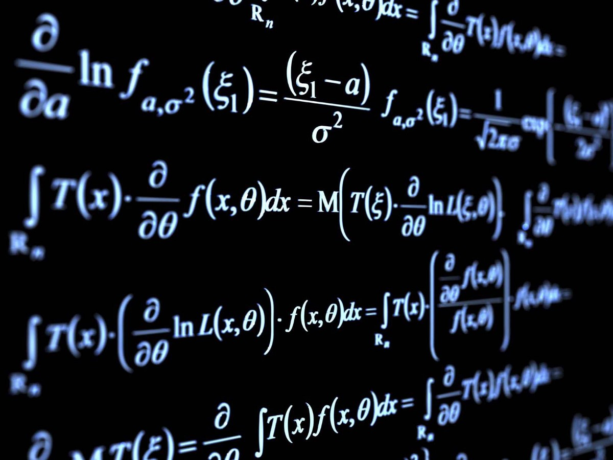
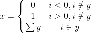
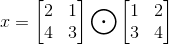
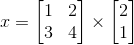

这只是几个示例，但是对这种简单代码的理解可以使任何程序员承担起初不祥的数学世界。 当然，这些方法都可以合并以提高效率，并且通常具有易于使用的库方法。 用简单的代码编写这些代码的目的是查看以真实操作的形式写出它们时的意义。

在Twitter或LinkedIn上继续与我对话！

资料来源

[1]https://commons.wikimedia.org/wiki/File:Pure-mathematics-formulæ-blackboard.jpg
# 用代码了解数学符号
## 当我们用自己喜欢的语言查看求和，阶乘，矩阵等时，它们很简单

> Source


对于任何有兴趣从事机器学习和数据科学事业或研究的人来说，是时候超越python库，追随好奇心进入所有数学背后的日子了。 通常，这将带您进入大量公开的论文集，详细说明其工作原理。 您对核心数学的理解越深入，您就越可能一见倾心就创建了一种新方法。 在您遇到类似以下内容之前，第一篇文章上的所有内容似乎都还不错：


对于已经学习数学多年或在机器学习的数学水平上工作的任何人，可以将这样的方程式仔细地解析为含义和代码。 但是对于许多其他人来说，这看起来像象形文字。 事实是，古代数学领袖似乎似乎选择了最有趣的外观符号来描述相当直观的方法。 结果是：方程和变量看起来比实际复杂得多。

我发现代码不仅可以用于编写程序，还可以用于解释复杂性的全球通用语言。 当我学习所有数据科学背后的数学时，我总是发现，获得对数学的普遍理解的最佳方法是编写代码段来描述方程式。 最终，这些符号被理解为几乎可以在典型论文中将其理解为文本。 在本文中，我希望分享一些示例，说明用代码描述数学的简单性！
# 求和与乘积


求和符号是迭代数学中最有用和最常用的符号之一。 尽管设计复杂，但是实现还是相当简单，但却非常有用。
```
x = [1, 2, 3, 4, 5, 6]result = 0for i in range(6):    result += x[i]Output of print(result) -> 21
```

如上所示，此符号代表的所有内容都是从顶部的数字开始的for循环，在顶部的数字范围内。 在底部设置的变量将成为索引变量，并且每个循环的所有结果都将添加到总值中。 较不常见的是，可以使用以下方法：


通常称为乘积运算符，该符号以相同的方式起作用，但不是将每个结果相加，而是将它们相乘。
```
x = [1, 2, 3, 4, 5, 1]result = 1for i in range(6):    result *= x[i]Output of print(result) -> 120
```
# 阶乘

阶乘是“！” 几乎所有计算器上都存在。 对许多人来说，这可能更明显一些，但是仍然值得编写一些代码以了解其原理。

5！ 将表示为：
```
result = 1for i in range(1,6):    result *= iOutput of print(result) -> 120
```
# 条件括号


条件括号用于根据一组条件转移方程的流程。 对于编码人员，这只是常见的“ if”语句。 以上条件可以表示为：
```
i = 3y = [-2, 3, 4, 1]result = 0if i in y:    result = sum(y)elif i > 0:    result = 1else:    result = 0print(result) -> 6
```

如上所示，括号中每一行的正确表示法规定了每个路径应执行的操作。 我还将多余的“包含”符号放入每个条件中，以增加更多的见解。 如上所示，我们检查了i值是否在y列表中。 认识到确实如此，我们返回了数组的总和。 如果i值不在数组中，我们将基于该值返回0或1。
# 点明智和笛卡尔矩阵乘法

最后，我想快速介绍一下任何数据科学家通常通过其喜欢的语言库（矩阵乘法）完成的操作。 最容易理解的形式是逐点操作。 简写为：


请注意，第一个要求是每个矩阵必须具有相同的形状（即＃rows =＆＃Columns =）

此代码如下所示：
```
y = [[2,1],[4,3]]z = [[1,2],[3,4]]x = [[0,0],[0,0]]for i in range(len(y)):    for j in range(len(y[0])):        x[i][j] = y[i][j] * z[i][j]print(x) -> [[2, 2], [12, 12]]  
```

最后，让我们看一下机器学习中最常用的典型矩阵乘法过程。 用复杂的术语来说，此运算将找到每个主要行与每个次要列的点积。 这样做的主要目的是：假设[#rows，#columns]→矩阵ixj要求#columns（i）== #rows（j）→最终产品的形状为[#rows（i）， #columns（j）]

这似乎令人困惑，我最好的建议是看一下Google图片，以直观了解这些要求。


该方程的代码如下（使用numpy点方法）：
```
y = [[1,2],[3,4]]z = [[2], [1]]# x has shape [2, 1]x = [[0], [0]]for i in range(len(y))    for j in range(len(z):        x[i][j] = np.dot(y[i], z[:, j])print(x) -> [[4],             [10]]
```
```
(本文翻译自Ian Rowan的文章《Understanding Mathematical Symbols with Code》，参考：https://towardsdatascience.com/understanding-mathematical-symbols-with-code-5aa0c542644)
```
