# 为什么和何时避免将S3用作Data Lakes的数据平台

如今，数据湖在大型企业中风靡一时。 数据湖是单个存储，用于存储源系统数据的原始副本和转换后的数据，以用于报告，可视化，高级分析和机器学习等任务。
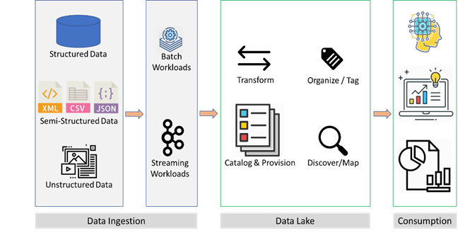
> Figure 1: Data lake ecosystem


对象存储（如S3）正成为数据湖的首选平台，原因有两个：
+ 它们在云中提供廉价，持久且几乎无限的存储
+ 它们实现了计算和存储的分离，从而可以独立扩展任何一个

在这篇博客文章中，我将更深入地探讨对象存储的一些优点，这些对象存储成为数据湖平台的流行。 我还将研究一些经常被低估的难题，这些难题困扰着许多数据湖用例的对象存储。
# 对象存储的好处：持久，便宜且几乎不受限制的存储

像S3这样的对象存储提供11个9的耐用性（99.999999999％）和四个9的可用性（99.99％），并且他们设法以几乎无限的规模做到了这一点，其价格低得令人难以置信，约为$ 23 / TB / TB。 与此形成鲜明对比的是，几年前流行的本地数据仓库设备（DWA）。 不包括企业支持，DWA每TB的成本为数万美元。 仅支持数百TB的数百万美元的DWA合同是很常见的。

当IT领导者考虑为其数据湖选择数据平台时，对象存储的$ 23 / TB /月的价格标签实在令人无法抗拒。 使用最便宜的存储空间来存储预期将要容纳的数据湖的大量数据（从数百TB到PB）是有意义的。 像S3这样的对象存储（不正确，我们将在本文后面看到）似乎比许多大型企业仍在使用的DWA具有千倍的定价优势。
# 对象存储的好处：存储和计算的分离

数据湖所需的存储规模使使用DWA之类的架构（将存储和计算耦合到单个程序包中）的成本过高。 通过解耦存储和计算，我们可以在任何给定时间携带适当数量的按需计算，以承载需要分析的数据。 这大大降低了数据分析解决方案的总体成本。
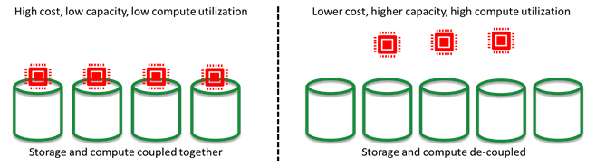
> Figure 2: Separation of storage and compute


可以理解，所有这些优势对于推动S3和其他对象存储作为数据湖平台的普及至关重要。 但是对象存储面临很多挑战，没有引起足够的重视。 对于源于RDBMS且经常刷新（每天/每小时）的数据尤其如此，后者构成了企业中大量的高质量数据。
# 对象存储的缺点：不变性

所有对象存储，包括S3，GCS和Azure Blob存储，都是不可变的。 这意味着，一旦将文件写入对象存储，就无法对其进行编辑。 用户只能硬删除旧文件并创建一个新文件，或者在逻辑上删除该旧文件并创建一个新文件（版本控制）。

当使用S3作为源于RDBMS且经常刷新的数据的数据平台时，这将导致为每个表创建大量的小文件。
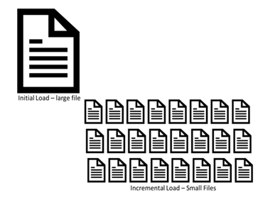
> Figure 3: The problem of many small files for RDBMS-sourced data


随着插入，更新和删除随着时间的推移而堆积，尝试导出表的当前状态将成倍增加时间和计算量。 大多数数据科学家都对这项复杂的工作不屑一顾，而是要求直接访问源系统，从而一开始就破坏了使用数据湖的目的。
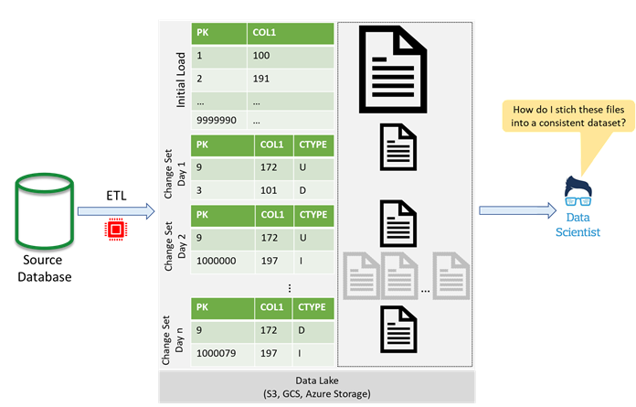
> Figure 4: Problems with using raw changesets on S3


U =更新，I =插入，D =删除
# 解决方案，第1部分：对数据进行分区

解除最终用户合并变更责任的一种解决方案是对数据进行分区，然后重新写入最新插入，更新和删除所针对的分区。 这在一定程度上减轻了最终用户的负担。 但是，仍然存在性能问题，特别是如果表中包含大量列并且仅需要这些列的子集进行分析时。
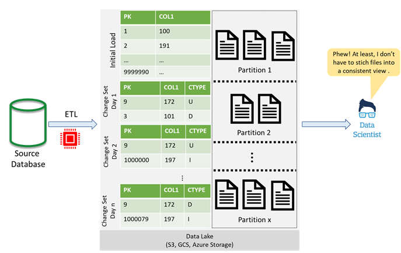
> Figure 5: Using partitions to merge changesets

# 解决方案，第2部分：使用列式存储

通过使用诸如Apache Parquet或Apache ORC之类的列格式，可以改进上述解决方案。 列格式通过更好地压缩数据并将I / O限制为仅用于分析所需的列，从而显着提高了性能。 但是，从语言和工具（如Python，R或Tableau）读取Parquet文件仍然很困难。
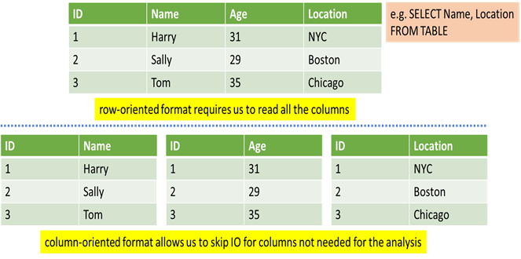
> Figure 6: Columnar storage helps with performance

# 解决方案，第3部分：使用SQL接口简化访问

为了进一步构建此解决方案，许多工程师在原始Parquet文件上添加了SQL接口（例如AWS Athena，Presto或Spark SQL）。 这使最终用户的数据访问变得更加简化，最终用户现在可以跨自己喜欢的编程语言和工具（例如Python，R或Tableau）发出SQL查询。
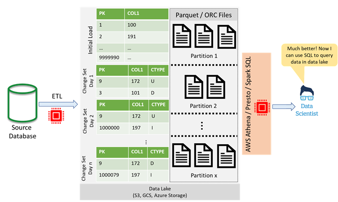
> Figure 7: SQL interfaces simplify access to data in a data lake

# 解决方案，第4部分：使用Delta Lake添加功能

通过使用像Delta Lake这样的开源存储层，可以再次改进上述解决方案。 Delta Lake通过增加对ACID（原子性，一致性，隔离性，持久性）交易的支持，支持流和批处理用例的lambda架构以及访问先前刷新日期/之前的数据的能力，进一步改进了Parquet格式。 时间（时间旅行）。
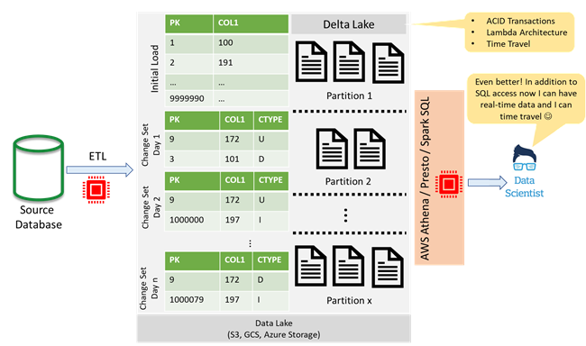
> Figure 8: Delta Lake adds transactions, simultaneous batch and streaming use cases, and time travel

# 问题解决了？

没那么快！ 上面的架构确实代表了可行的解决方案，并且许多企业为能够设计和实施这种解决方案而自以为是。 公平地说，能够大规模实现这一目标是相当可观的。 但是，该体系结构仍然困扰着许多问题，并且还有很多改进的余地。 作为数据湖平台的S3上的Delta Lake的关键问题包括：
+ 该体系结构无法解决变更集的创建问题，因此创建变更集可能会遇到很大的挑战
+ 实施和支持企业级的弹性提取，转换和加载（ETL）解决方案非常复杂
+ 编写Parquet和Delta文件需要额外的计算以及技术知识，才能大规模配置和运行集群计算平台（例如Apache Spark）
+ SQL接口访问（通过AWS Athena，Presto或Spark SQL等技术）需要附加的计算基础架构，从而增加了解决方案的整体复杂性和成本
+ 解决方案的复杂性使其支持成本高昂
+ S3提供有限的元数据和标记功能
+ 在S3中的对象上集成表级或行级安全性，尤其是对于大型和复杂的企业，可能会非常具有挑战性
+ 最后但并非最不重要的一点是，这种平台的性能远远落后于它打算取代的数据仓库设备的性能

考虑到隐藏的计算和支持成本，安全性集成和性能问题，S3作为用于RDBMS的，经常刷新的数据的数据平台，与其每月每TB 23美元的承诺相去甚远。 一旦我们将所有成本加起来，它便开始攀升至每月每TB数千美元的范围。 对于那种钱，有很多更好的选择。

诸如Snowflake，Google BigQuery或Azure Synapse Analytics之类的云级托管分析数据库提供了两全其美的优势。 通过将存储和计算分开，它们提供了S3可比的存储成本以及可管理的数据平台，该平台抽象了实现云规模分析解决方案的复杂性。 它们具有AWS Athena / Presto / Spark SQL界面，提供了与基于S3的Parquet / ORC / Delta Lake类似的TCO，同时拥有更好的性能，安全性集成和架构支持。 它们还减少了运营开销，同时将技术和人才风险转移给了第三方供应商。
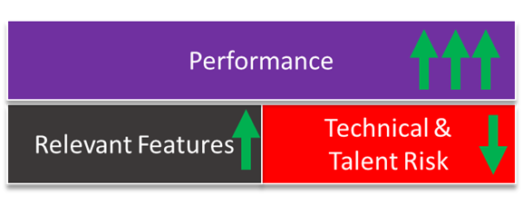
> Figure 9: Advantages of a managed analytics DBs over the “object-store + Delta Lake + SQL interfaces” solution

# 源自RDBMS的大部分为静态数据呢？

基于RDBMS的，大多数为静态数据（即数周或数月不变）不会像基于RDBMS的，经常刷新的数据那样产生大量的ETL计算和支持开销。 但是，对于此类用例，我的建议是首选基于云规模的托管分析数据库，而不是基于S3的Parquet / ORC / Delta Lake存储，因为围绕元数据管理，安全集成和性能的所有挑战和成本仍然存在。
# 那半结构化数据呢？

进入企业的大多数半结构化数据（通过XML，JSON和CSV等格式）都具有相当稳定的架构，可以将其吸收到关系表中。 大型企业中的大多数此类数据经常被吸收到AWS Redshift等分析数据库中，或通过基于S3的Parquet / ORC / Delta Lake存储通过SQL接口（如AWS Athena，Presto或Spark SQL）进行访问。 对于这种类型的用例，我的建议是考虑将存储和计算分开的托管分析数据库。
# TCO应该是您的北极星

最后，应根据总拥有成本（TCO）来考虑解决方案，并要考虑它们带来的功能和解决方案固有的风险。 如果两种解决方案的总拥有成本相似，但是其中一种提供了更好的功能，那么与该解决方案保持一致就很容易了。 此外，应仔细考虑与内部开发的解决方案相关的技术和人才风险。 通常，对于大型企业，在合理的情况下，将技术和人才风险转移到信誉良好的供应商产品上更为合理。
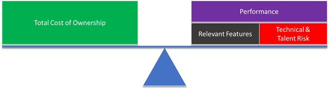
> Figure 10: Balancing TCO, performance, features, and risk

# 那么什么时候对象存储可用作数据湖平台？

对于其他用例，例如半结构化和非结构化数据，由于（出于成本或实用性的原因）不能或不应该将其吸收到云规模分析数据库中，对象存储（如S3）仍然是一个极好的数据平台。 例如，将图像，音频文件，视频，电子邮件，PowerPoint演示文稿，Word文档或PDF提取到托管分析数据库中是没有意义的。 此外，许多这些云规模的分布式数据库都使用对象存储（如S3）作为它们的数据摄取接口，甚至有一些甚至使用对象存储作为幕后的内部管理存储平台。
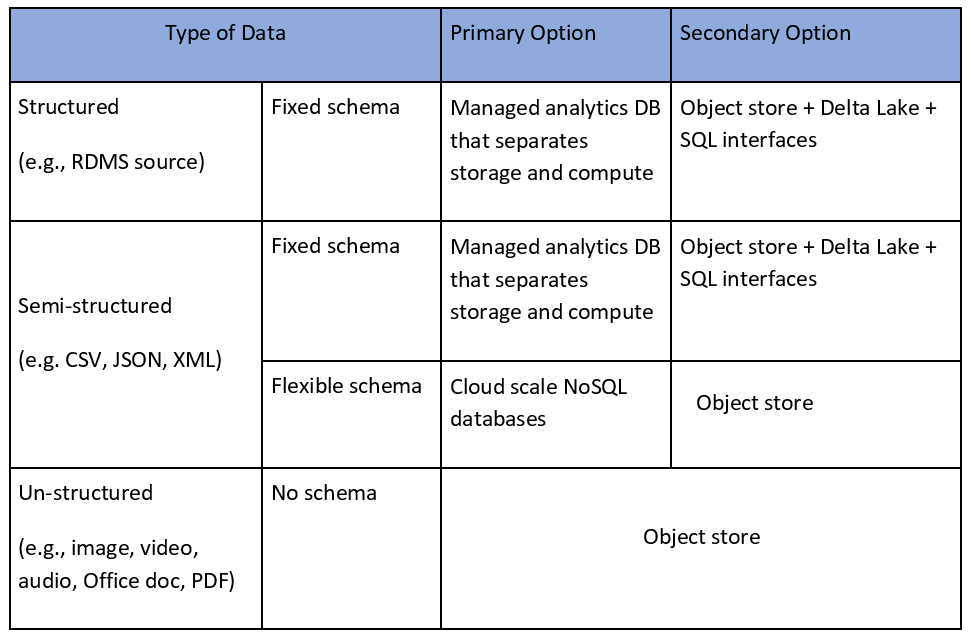
> Table 1: Recommendations


在以后的文章中，我们将深入讨论为什么将存储和计算分开的云级托管分析数据库（例如Snowflake，Google BigQuery或Azure Synapse Analytics），以及专门构建的CDC工具（例如Qlik Replicate，Oracle GoldenGate或 HVR CDC）更适合企业数据湖中源自RDBMS的，经常刷新的数据。
```
(本文翻译自Farhan Siddiqui的文章《Why and When to Avoid S3 as a Data Platform for Data Lakes》，参考：https://medium.com/swlh/why-and-when-to-avoid-s3-as-a-data-platform-for-data-lakes-c802947664e4)
```
