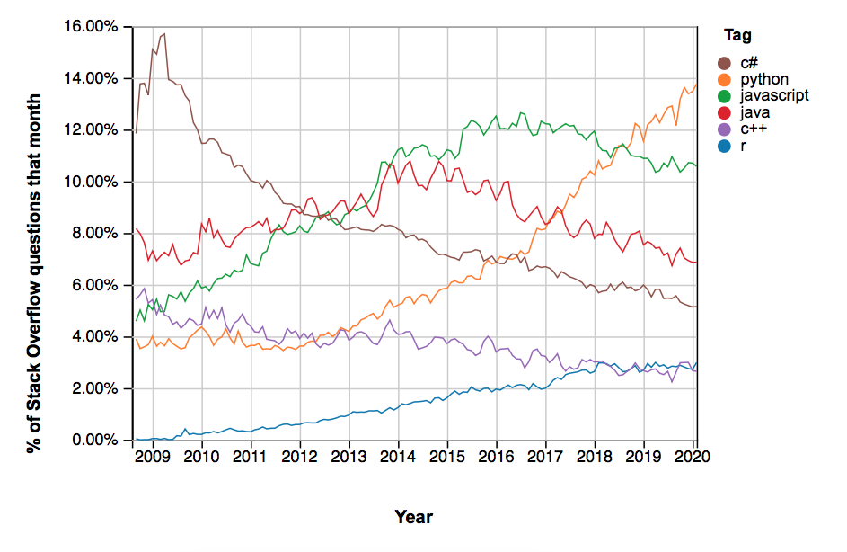
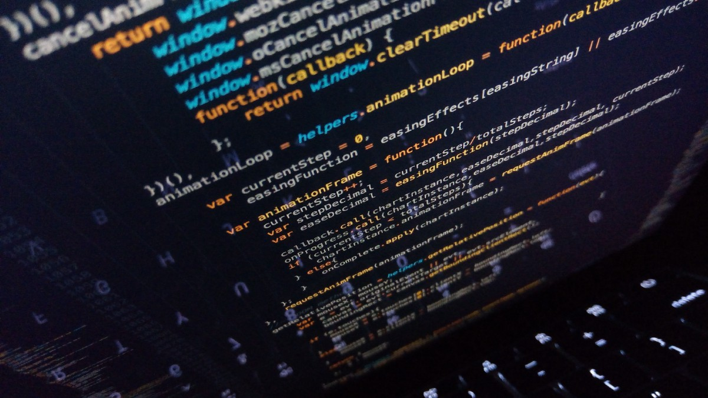
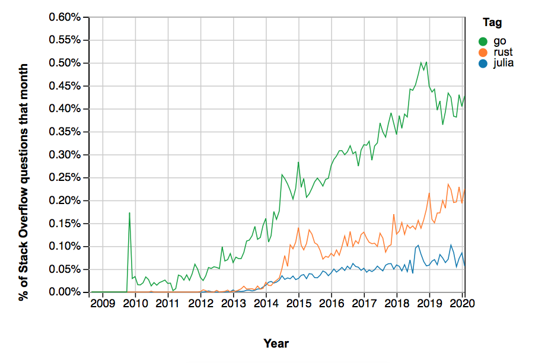

## 意见
# 为什么Python不是未来的编程语言
## 即使未来几年需求量很大

> Python has served us well — but will it last? Photo by David Clode on Unsplash


编程社区花了几十年才意识到Python。 但是自2010年初以来，它一直在蓬勃发展-并最终超过了C，C＃，Java和JavaScript。

但是直到这种趋势将持续到何时？ Python最终何时会被其他语言取代，为什么？

在Python上指定确切的到期日期将是很多猜测，它可能会像科幻小说一样过去。 相反，我将评估目前正在促进Python普及的优点，以及将来会破坏它的弱点。
# 是什么让Python立即流行

Python的成功体现在Stack Overflow趋势上，该趋势衡量了平台上帖子中标签的数量。 考虑到StackOverflow的大小，这是语言受欢迎程度的很好指标。

> Snapshot of tags on various programming languages on StackOverflow.


尽管R在过去几年一直处于平稳状态，而许多其他语言也在稳步下降，但Python的增长似乎势不可挡。 在所有StackOverflow问题中，几乎有14％被标记为“ python”，并且这种趋势还在上升。 这有几个原因。
## 老了

自90年代以来，Python就已经存在了。 那不仅意味着它有足够的时间成长。 它还获得了一个庞大的支持社区。

因此，如果您在使用Python进行编码时遇到任何问题，则很有可能通过一次Google搜索就可以解决该问题。 仅仅是因为有人会遇到您的问题，并为此写了一些有用的东西。
## 初学者友好

它已经存在了数十年，这不仅是事实，它还使程序员有时间制作出色的教程。 不仅如此，Python的语法非常易于理解。

首先，无需指定数据类型。 您只需要声明一个变量即可； Python会从上下文中了解它是整数，浮点值，布尔值还是其他值。 对于初学者来说，这是一个巨大的优势。 如果您曾经使用C ++进行编程，那么您会知道程序将不会令人沮丧，因为您将浮点数替换为整数。

而且，如果您曾经不得不并行阅读Python和C ++代码，那么您将了解Python的可理解性。 尽管C ++的设计考虑了英语，但与Python代码相比，它的阅读还是相当坎bump。
## 学习Python：从零到英雄
### 快速全面的Python入门指南。
## 用途广泛

由于Python已经存在了很长时间，因此开发人员已经为各种目的制作了一个程序包。 这些天，您可以找到几乎所有东西的包装。

是否想处理数字，向量和矩阵？ NumPy是你的家伙。 是否想对技术和工程进行计算？ 使用SciPy。 是否想在数据处理和分析方面大做文章？ 快去熊猫吧，想从人工智能开始吗？ 为什么不使用Scikit-Learn。

无论您要管理哪种计算任务，都有可能会使用Python程序包。 从过去几年机器学习的迅猛发展可以看出，这使得Python处于最新发展的最前沿。
# Python的缺点-以及它们是否会致命

根据先前的论述，您可以想象Python会在很长一段时间内保持在sh * t之上。 但是像所有技术一样，Python也有其弱点。 我将一一介绍最重要的缺陷，并评估这些缺陷是否致命。
## 速度

Python很慢。 喜欢，真的很慢。 平均而言，使用Python完成任务所需的时间比使用任何其他语言大约要长2–10倍。

有多种原因。 其中之一是它是动态类型的-请记住，您不需要像其他语言一样指定数据类型。 这意味着需要使用大量内存，因为程序需要为在任何情况下都可以工作的每个变量保留足够的空间。 而且大量的内存使用量转化为大量的计算时间。

另一个原因是Python一次只能执行一个任务。 这是灵活的数据类型的结果-Python需要确保每个变量只有一个数据类型，并且并行进程可能会将其弄乱。

相比之下，普通的Web浏览器可以一次运行十二个不同的线程。 周围还有其他一些理论。

但归根结底，所有速度问题都无关紧要。 电脑和服务器的价格如此便宜，以至于我们谈论的只是几分之一秒。 最终用户并不真正在乎他们的应用是在0.001或0.01秒内加载。
## 为什么Python（尽管（慢）慢）仍然受欢迎
### Bobby很好地解释了Python中速度问题的重要性。
## 范围

最初，Python是动态作用域的。 这基本上意味着，为了评估表达式，编译器首先搜索当前块，然后依次搜索所有调用函数。

动态范围界定的问题在于，每个表达式都需要在每个可能的上下文中进行测试-这很繁琐。 这就是为什么大多数现代编程语言都使用静态作用域。

Python试图过渡到静态作用域，但搞砸了。 通常，内部范围（例如函数中的函数）将能够查看和更改外部范围。 在Python中，内部范围只能看到外部范围，而不能更改它们。 这导致很多混乱。
## Lambdas

尽管Python具有所有灵活性，但Lambdas的使用还是有一定的局限性。 Lambda只能是Python中的表达式，而不能是语句。

另一方面，变量声明和语句始终是语句。 这意味着Lambda不能用于它们。

表达式和语句之间的区别相当随意，在其他语言中则没有。

> Whitespaces make code more readable, but less maintainable. Photo by Irvan Smith on Unsplash

## 空格

在Python中，您使用空格和缩进来指示不同级别的代码。 这使其具有视觉吸引力和直观的理解。

其他语言（例如C ++）更多地依赖花括号和分号。 尽管这可能在视觉上并不吸引人并且对初学者不友好，但它使代码更具可维护性。 对于较大的项目，这会有用得多。

像Haskell这样的较新的语言解决了这个问题：它们依靠空格，但是为那些希望不用空格的人提供了另一种语法。
## 移动开发

目睹了从台式机向智能手机的转变，很明显，我们需要强大的语言来构建移动软件。

但是用Python开发的移动应用程序并不多。 这并不意味着它无法完成-为此，有一个名为Kivy的Python包。

但是Python并不是考虑到移动设备的。 因此，即使对于基本任务可能会产生合格的结果，但最好的选择是使用为移动应用程序开发而创建的语言。 一些广泛使用的移动编程框架包括React Native，Flutter，Iconic和Cordova。

undefined
## 运行时错误

首先不编译Python脚本，然后执行。 相反，它每次执行时都会编译，因此任何编码错误都会在运行时显示出来。 这会导致性能下降，时间浪费以及需要进行大量测试。 像，很多测试。

这对初学者非常有用，因为测试可以教给他们很多。 但是对于经验丰富的开发人员而言，必须使用Python调试复杂的程序会使他们出问题。 性能的不足是在Python上设置时间戳的最大因素。
## 现在需要学习的7种现代编程语言
### undefined
# 将来什么时候可以取代Python？

编程语言市场上有一些新的竞争者：
+ Rust提供了与Python相同的安全性-不会意外覆盖任何变量。 但是，它通过所有权和借款的概念解决了绩效问题。 根据StackOverflow Insights的说法，它也是近几年最受欢迎的编程语言。
+ Go非常适合像Python这样的初学者。 它是如此简单，以至于维护代码甚至更加容易。 有趣的地方：Go开发人员是市场上收入最高的程序员之一。
+ Julia是一种非常新的语言，可与Python正面竞争。 它填补了大规模技术计算的空白：通常，人们会使用Python或Matlab，并使用C ++库对整个程序进行修补，而这是大规模所必需的。 现在，人们可以使用Julia而不是两种语言的玩杂耍。

尽管市场上还有其他语言，但Rust，Go和Julia是可以修复Python弱补丁的语言。 所有这些语言在尚未出现的技术中都表现出色，最著名的是人工智能。 尽管它们的市场份额仍然很小，如StackOverflow标签的数量所示，但所有这些标签的趋势都很明显：向上。

> Snapshot of tags on various programming languages on StackOverflow.


考虑到目前Python的无处不在，要用这些新语言中的任何一种来取代它肯定要花上半年的时间，甚至可能是整个时间。

在这一点上很难说它将是哪种语言-Rust，Go，Julia或未来的新语言。 但是考虑到Python体系结构中最基本的性能问题，将不可避免地引起人们的关注。
```
(本文翻译自Rhea Moutafis的文章《Why Python is not the programming language of the future》，参考：https://towardsdatascience.com/why-python-is-not-the-programming-language-of-the-future-30ddc5339b66)
```
