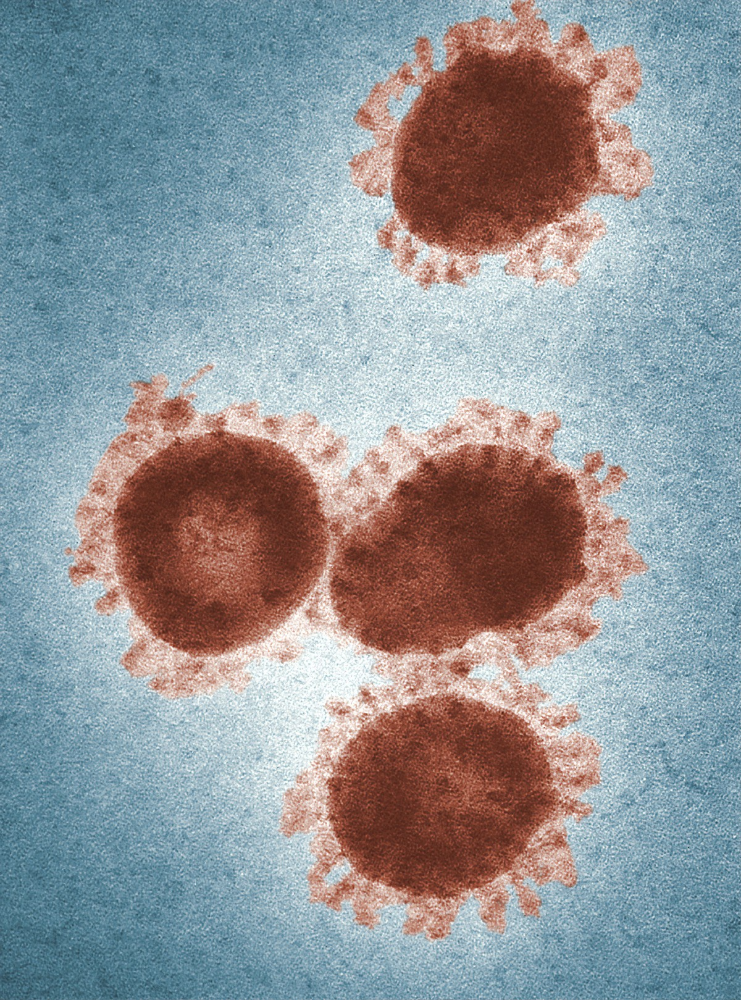
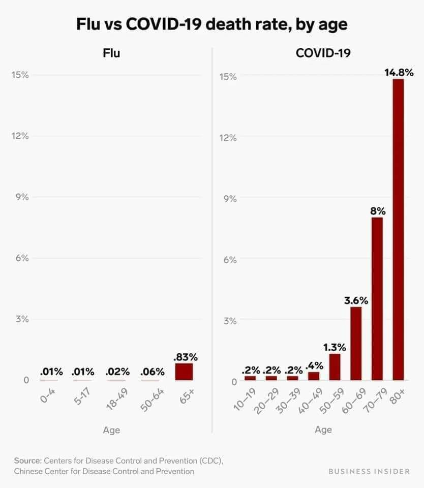
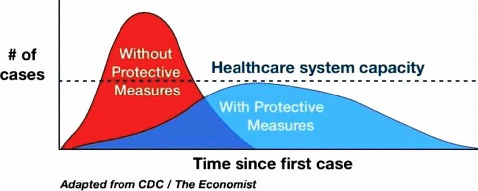

# 将事实与关于COVID-19的错误信息区分开
## 您应采取的事实，道德和保护措施

> Photo: CDC/Unsplash


在此关注Elemental对冠状病毒爆发的持续报道。

我是与疾病传播相关的在线虚假信息，错误信息和数学专家。 最近，我在社交媒体上回答了许多有关COVID-19的常见问题，以消除误解和虚假信息。

在本篇文章中，我整理了一份最常见的问题和回答的清单，希望可以使这些信息更易于访问。 请注意：我不是公共卫生或医疗专业人员； 但是，我已经格外小心地将我在这里的所有答复与官方指导和医疗建议相吻合。
## 为什么人们比流感更害怕COVID-19？

每个感染季节性流感的人都可能感染约1.3其他人。 对于SARS-CoV-2（导致COVID-19的病毒），估计感染的人数约为三倍（估计为2-4）。 该数字称为生殖因子（或R0，有时发音为“ R-naught”），您可能会看到它的提法。 较高的生殖因子意味着COVID-19将很快导致更多很多病例，并且可能使已经负担沉重的医疗系统不堪重负。

即使您自己没有高风险，我们仍然都有公共卫生义务采取干预措施以防止其扩散。
## 为什么我什至应该关心我是否得到它？ 似乎并不致命。

的确，对于50岁以下的健康人来说，它的致死性并不特别强-死亡率相当低，尽管仍比流感高20倍。 但是对年老的患者来说，致死性更大。 下图根据年龄段和流感相比，给出了死亡率的良好估算。 世界卫生组织估计平均死亡率为3.4％，约为流感的100倍-但要注意的是，平均死亡率跨年龄段。 当前的证据表明，对于老年人以及患有心血管疾病，糖尿病和癌症等疾病以及免疫力低下的人，COVID-19的死亡率为9％至19％。 即使您自己没有高风险，我们仍然都有公共卫生义务采取干预措施，以防止可能使卫生保健系统不堪重负的传播，就像意大利现在发生的情况一样。

> Covid-19 mortality rates go up dramatically with age, compared with flu.

## 如果我有可能得到它，为什么在看起来不太危险的情况下为什么不继续日常工作呢？

不要成为占用别人比您更需要的医疗资源的人。 这是我们道德上与这种疾病有关的北极星。 目标应该是最大程度地减少传播，以便在需要卫生资源（诊断，治疗，呼吸机，氧气浓缩器等）时，最需要它们的人可以使用它们。 下图确切说明了为什么这很重要。 如果我们可以放慢传播速度，我们将有更多时间做出反应并进行必要的准备。 传播速度减慢将挽救许多生命，因为不堪重负的医疗保健系统将无法为所有需要的人提供护理。 医疗保健专家称此为“拉平曲线”，这也许是我们减轻这种情况的最佳且唯一的策略。

## 其他疾病（例如SARS，MERS或H1N1）是否更具致命性？ 那么，为什么要吓一跳呢？

问题不在于COVID-19的致死性，而在于爆发的整体影响。 虽然这些其他疾病可能更具致死性，但生殖因子（R0），人群的接受性（敏感性）和免疫力的结合可能使它们更易于控制。 SARS-CoV-2（引起COVID-19的病毒）对人群来说是全新的，因此没有人可以免疫。 每年，由于接触先前的变种或每年进行疫苗接种，人们已经对流感免疫。 尚无SARS-CoV-2疫苗。 我们应该期望至少在2021年第一季度才能广泛使用经过测试的疫苗。 同时，每个人都可能容易受到攻击，因此我们应该期望会有大量人被感染。
## 有多少人会被感染？ 这真的很重要吗？

是的，这确实很重要。 由于没有真正的传播障碍并且生殖因子（R0）很高，因此有可能而且确实有可能感染全球20％至70％的人口。 那是15亿到50亿人。 估计死亡率约为2％，即全球有3000万至1亿人死亡。

在美国，我们可以预计将有6600万至2.31亿人被感染，其中120万至460万人死亡，甚至可能更多。 这也可能被高估了。 我们还不知道“真正的”死亡率，但是世界卫生组织估计它可能高达3.4％。 但是死亡率并不像医疗系统不堪重负的事实那样重要，因为这一切都会很快发生。 是的，很多人会死。 我们只是不知道有多少。 但是，如果我们尽早采取严格的收容措施，我们可以限制受感染的总人数。 这样可以挽救生命。
## 它会传播多快？

我们不知道，但是已知病例的翻倍速度似乎是每隔几天-需要提醒的是，报告的数字可能会低估实际病例。 这意味着，无需重大干预，这种感染将在几周或几个月内传播到世界上大部分人口。 如上所述，这可能多达15亿至50亿人。
## 像流感一样，夏天气温升高时，这种镇静会不会平静下来？

我们还不知道。 有一些理由认为这种疾病可能会在温度升高时减慢。 但是，它的生殖因子（R0）高，前驱病（无症状）周期高，大约14天，与流感不同。 像新加坡这样的较温暖的国家现在也有这种情况。 我们正在观察其他有案例的温暖国家的事态发展。 人们可能是携带者而没有出现症状。 虽然通过表面传播（可以在其中存活数天）会随温度降低，但我们不知道宿主之间的传播方式或方式是否受到影响。 因此，尽管温度升高，它可能会持续到夏季，同时还将其流行转移到温度较低的南半球。 在秋天，如果有易感人群被感染，它可能会从停止的地方恢复并继续感染人。 如果可能以某种方式再次感染或出现突变，它可能会重新感染人。 不要期望到9月结束。
## 什么时候可以接种疫苗？ 我们不能停止这件事吗？

疫苗正在开发中，但是将可行的，经过测试的疫苗推向市场需要时间。 虽然有些团队声称现在已经接种疫苗，但仍需要一些时间来完善，测试，制造，销售和提供这些解决方案。 为数十亿人生产足够的疫苗绝非易事，将需要时间，资金和与政府的协调。 估计表明，最快将在2021年第一季度提供任何疫苗。
## 我应该如何保护自己？ 我应该购买手消毒液吗？

最好的防御方法是经常用肥皂和水洗手，而不要碰到脸，鼻子，眼睛和其他粘液器官。 虽然酒精含量高的洗手液有效，但肥皂和水非常有效，应该是您的首选。 肥皂分子的脂肪端附着并穿透病毒的脂质壳，而亲水端（嗜水）端则水附着在病毒上并用病毒冲洗掉肥皂。 洗手液可能会使病毒无能为力，但会将病毒留在您的手上。 经常洗手。 与他人保持距离，并避免不必要的旅行和社交聚会。 以下是CDC的一些建议。 如果您不方便使用肥皂和水，请去您可以去的地方呆在那里。

传播速度减慢将挽救许多生命，因为不堪重负的医疗保健系统将无法为所有需要的人提供护理。
## 中国和韩国证明这可以放慢和停止。 我们不能只是做他们做的事吗？

中国和韩国政府都采取了极为果断的行动，以尽量减少这种疾病的传播。 中国政府是一个独裁政权，可以单方面强加并实施数周的封锁。 美国和欧洲的政府将很难做到这一点，但我们可能会看到关闭学校，取消活动，限制行动和其他社会疏远措施的势头越来越大。 意大利实行了一个月的封锁。 尼古拉斯·克里斯塔基斯（Nicholas Christakis）是1918年流感的专家，他建议我们越早这样做，将挽救更多的生命。
## 什么时候情况会恢复“正常”？

我们不知道 预计2020年3月，4月，5月和6月将受到严重干扰。 除此之外，我们可能会在天气温暖的情况下看到世界上部分地区的缓和（见上文）。 但是，鉴于要在2021年之前大规模生产可行的疫苗，我们应该至少希望在那之前会有一些中断。 我们应该能够对每个月进行更好的估计。 但是不要期望在任何可预测的时间表上一切都会恢复正常。 我们还可以看到秋天再次复苏。
## 恐慌似乎比疾病本身还糟。 我们真的应该为此担心吗？ 为什么会有这么多恐惧？

是! 恐慌，担忧和恐惧完全无济于事。 相反，我们应该现实而有准备，我们应该有一个合理的框架来考虑我们对此的反应，并在政府机构的完全透明下进行。 尽管目前我们可能未达到此标准，但我们当然可以冷静下来并理解其背后的数学原理，并采取合理的措施将风险降至最低。 确保准备两到三周的食物和必要的药物是一个很好的准备。 避免ho积补给品，尤其是呼吸面罩之类的东西，这仅在处于危险状况时才有用。 希望此问题和答案列表有助于以正确的角度看待问题。
## 为什么会议被取消？

疾病预防控制中心（CDC）提出，社会疏远措施和限制不必要的旅行可以帮助减缓疾病在社区中的传播。 许多会议组织者还面临与会人员，赞助商和承包商关于参加活动或在活动中工作的退缩。 在某些情况下，地方政府强迫取消大型活动。 因此，许多组织者正在决定将事件推迟到以后再解决，或者将事情搁置一旁。 通常，您应该考虑最大程度地减少与大型团体的接触是对社会负责的事情。 而且，如果您必须旅行，则可以考虑开车，乘飞机或乘火车。 有些人建议取消所有不必要的聚会和活动。

要获得比这些更全面，更科学详细的答案，我鼓励您紧跟CDC和WHO的意见。 再一次，我不是医学专家，只是一个擅长阅读，数学和基础推理的人。 我们都必须鼓励采取直接的信息共享和预防方法，并防止恐慌。 在一起，我们可以解决这个问题。

冠状病毒的爆发正在迅速发展。 要保持最新状态，请查看美国疾病控制与预防中心和您当地的卫生部门以获取最新信息。 如果您在情感上不知所措，请与“危机文本行”联系。
```
(本文翻译自Dave Troy的文章《Separating the Facts From the Misinformation About COVID-19》，参考：https://elemental.medium.com/why-we-should-care-commonly-asked-questions-and-answers-about-covid-19-6b166f1876e9)
```
